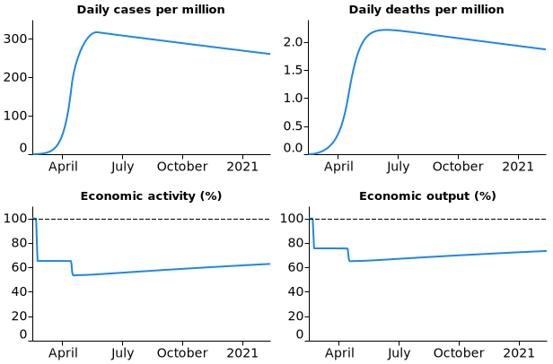

# Econ-SIR

Econ-SIR model implementation using JAX. Works best with Python 3.8.

Check out `econsir.ipynb` for a quick walkthrough of simulation, estimation, and optimal policy.

To run the built-in dashboard, execute
```
python3 dash.py
```

Here's an example of a generated path

